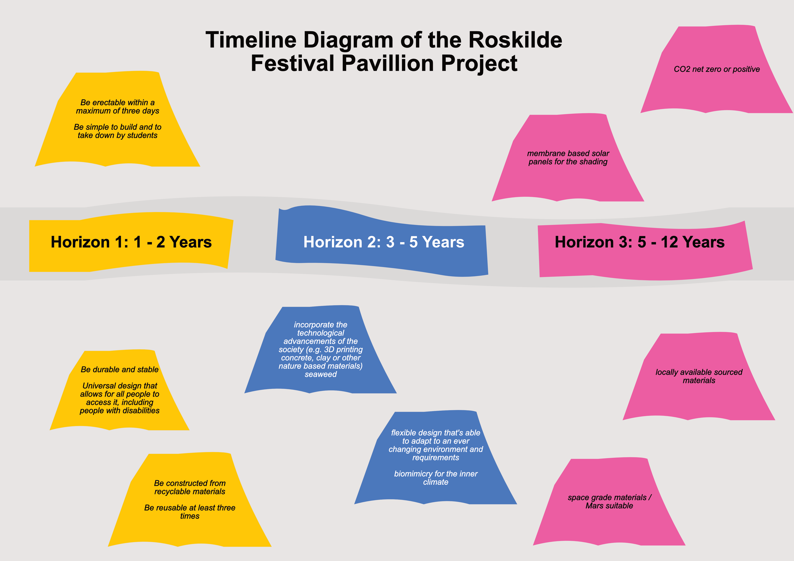

# Assignment 1 - Group 25

## Forecast of Futures

When envisioning the Roskilde festival, we must embrace both the present and the near future in our design approach for the Roskilde Pavilion. 
A modern pavilion design should be adapted to the ever evolving landscape and in the immediate 1-2 year horizon, we're well aware of the global 
challenges at hand. As with most industries nowadays, sustainability plays a crucial role in the decision making, therefore we see it as our top 
priority for our design.

To ensure the pavilion's environmental friendliness, it is important to prioritize the use of materials that are recyclable or preferably already 
recycled, facilitate design choices that allow for reusability, rapid construction, ease of use and accessibility for all.

As we look ahead to the next 3 -5  years, we expect that there will be more opportunities to use new and innovative materials and building methods. 
For example, we might see structures made through 3D printing using locally available resources such as clay and seaweed. The importance of sustainability 
is only going to increase, therefore our design must be flexible and able to adapt to the changing world around us. We also see the potential for using 
clever engineering inspired by nature (biomimicry) to bridge the gap between our industry and the natural world, promoting sustainability in the process.

Looking even further ahead, beyond the 5 - 12 year mark, we anticipate the implementation of rather strict regulations that will require all new structures 
to achieve carbon neutrality, and ideally, have a net positive environmental impact. If the previously described design considerations are implemented, 
the pavilion design should provide a strong foundation for meeting these future requirements. By ensuring the flexibility of the design, we leave a lot of 
room for future improvements, such as the ability to incorporate locally available materials, use solar cell membranes for sharing and explore more advanced 
materials for the eventual colonization efforts on Mars.

## Systems focus

In this project, our primary focus will be on the materials, structure and construction (build). We
view this selection as a logical match for the nature of a festival pavilion structure and believe
that by focusing on these aspects of the design, we can best achieve the previously described
targets of the nearest future.

## Planet A

When we have decided to chose to work with Planet A instead of planet B it’s because of several
arguments based on ethics and morals. 

The reason for not taking Planet B into consideration is also because of the need to take
the level of abstraction down a bit, so that the project can be as true to the reality we live in
today as possible. The exploration of space and the inclusion of space material could be a
very interesting thing to take into account but the solution would probably also be difficult to
incorporate in Horizon 1.  

There is a huge problem with the climate change, emission of greenhouse gases from the
industrialization, the bigger demand on individual transportation and the way we run the agriculture are 
all big reasons to the increase in global temperature. The warming phenomena is
the reason of change of weather patterns, natural disasters and acceleration of ice cap melting
which all lead to endangerment of coastal communities and biodiversity loss. The extraction
of natural resources, of which are slow to replenish, creates a deficiency in the use of the ma-
terials which are standardized in this day and age. The resource depletion consequence is of
course demanding an innovation of both recycling the materials used now, but also creating new
standards of the materials used in different industry processes.  

In summary the reason why the focus is on Planet A is because we believe the alterna-
tive isn’t in the Horizons that this project is aiming to cover, also the moral imperative for
humankind to co-exist with the incredible eco-system of the earth is of importance and lastly
creating stability and ensure the well-being of future generations.

## Project justification

The project group see this case as an intuitive case to work with, because of the fact that
the background and knowledge of the members include knowledge on materials, what the sus-
tainable choices are of those materials, and a good understanding of structural engineering. On
the other hand and in a very simple manner, the decision to chose the Roskilde Festival and
innovation of a new pavilion case is because of a strong connection between group member
Kasper Holst and the festival. Not only was he growing up in Roskilde but also went to the
festival from a very young age with his parents. The festivals DNA has always been to be all
including and trying to find new solutions to the problems we face. Whether it being about
climate, political problems or religious orientation.

